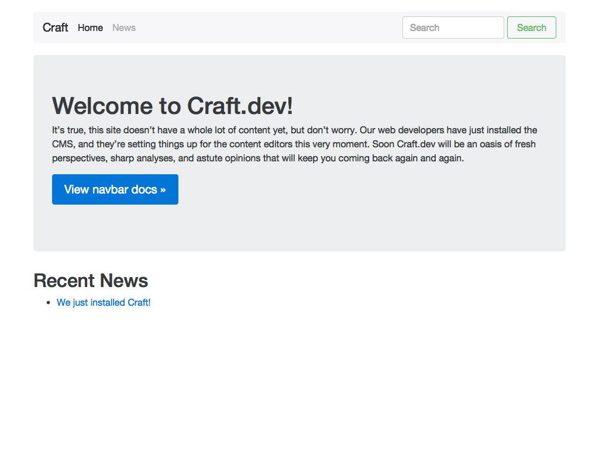
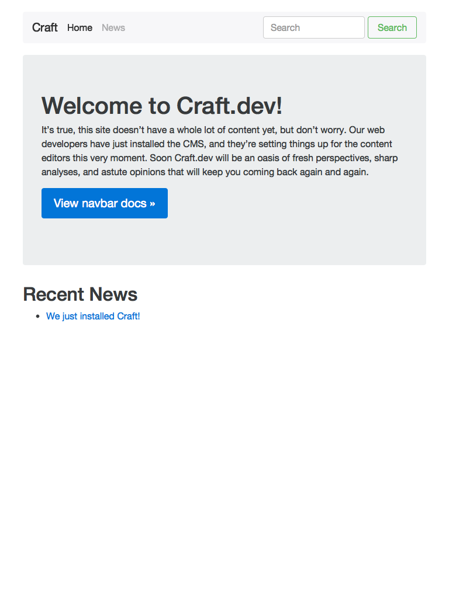
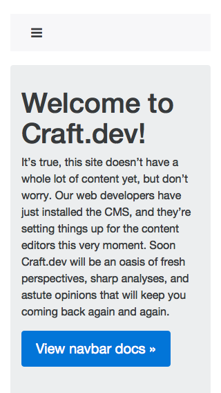

## Overview

[Web Starter Kit](https://developers.google.com/web/tools/starter-kit/) is an opinionated boilerplate for web development. Tools for building a great experience across many devices and [performance oriented](#web-performance). Helping you to stay productive following the best practices outlined in Google's [Web Fundamentals](https://developers.google.com/web/fundamentals/). A solid starting point for both professionals and newcomers to the industry.

### Gulp Process

| Task                                | Summary                                                                                                                                                                                                                                                     |
|----------------------------------------|-------------------------------------------------------------------------------------------------------------------------------------------------------------------------------------------------------------------------------------------------------------|
| Lint | Strict JS linting                          |
| Styles                                  | Compiles SCSS into CSS, automagically prefixes, generates source maps and minifies                                                                                                      |
| Performance optimization               | Minify and concatenate JavaScript, CSS, HTML and images to help keep your pages lean. (Run `gulp` to create an optimised version of your project to `/dist`)                                                                                                |
| Code Linting               | JavaScript code linting is done using [ESLint](http://eslint.org) - a pluggable linter tool for identifying and reporting on patterns in JavaScript. Web Starter Kit uses ESLint with [eslint-config-google](https://github.com/google/eslint-config-google), which tries to follow the Google JavaScript style guide.                                                                                                |
| ES2015 via Babel 6.0                   | Optional ES2015 support using [Babel](https://babeljs.io/). To enable ES2015 support remove the line `"only": "gulpfile.babel.js",` in the [.babelrc](.babelrc) file. ES2015 source code will be automatically transpiled to ES5 for wide browser support.  |
| Built-in HTTP Server                   | A built-in server for previewing your site locally while you develop and iterate                                                                                                                                                                            |
| Live Browser Reloading                 | Reload the browser in real-time anytime an edit is made without the need for an extension. (Run `gulp serve` and edit your files)                                                                                                                           |
| Cross-device Synchronization           | Synchronize clicks, scrolls, forms and live-reload across multiple devices as you edit your project. Powered by [BrowserSync](http://browsersync.io). (Run `gulp serve` and open up the IP provided on other devices on your network)                       |
| Offline support                     | Thanks to our baked in [Service Worker](http://www.html5rocks.com/en/tutorials/service-worker/introduction/) [pre-caching](https://github.com/google/web-starter-kit/blob/master/gulpfile.babel.js#L226), sites deploying `dist` to a HTTPS domain will enjoy offline support. This is made possible by [sw-precache](https://github.com/GoogleChrome/sw-precache/).                                                                                                                                              |
| PageSpeed Insights                     | Web performance metrics showing how well your site performs on mobile and desktop (Run `gulp pagespeed`)                                                                                                                                                    |

## Quickstart

[Download](https://github.com/google/web-starter-kit/releases/latest) the kit or clone this repository and build on what is included in the `app` directory.

There are two HTML starting points, from which you can choose:

- `index.html` - the default starting point, containing Material Design layout.
- `basic.html` - no layout, but still includes our minimal mobile best-practices

Be sure to look over the [installation docs](docs/install.md) to verify your environment is prepared to run WSK.
Once you have verified that your system can run WSK, check out the [commands](docs/commands.md) available to get started.

## Web Performance

Web Starter Kit strives to give you a high performance starting point out of the box. Our median Web Page Test [scores](http://www.webpagetest.org/result/151201_VW_XYC/) for the default template have a [Speed Index](https://sites.google.com/a/webpagetest.org/docs/using-webpagetest/metrics/speed-index) of ~1100 (1000 is ideal) and a repeat-visit Speed Index of ~550 thanks to Service Worker precaching. 

## Screenshots

#### Desktop

#### Ipad

#### iPhone 5s

